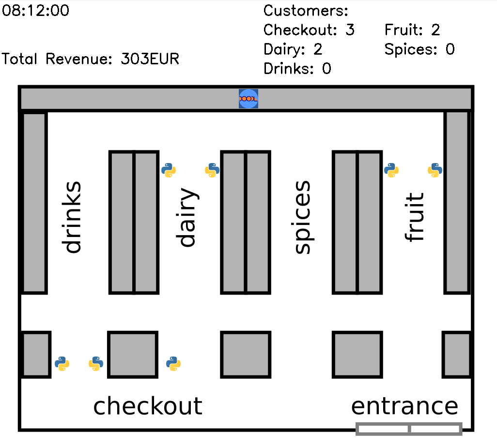
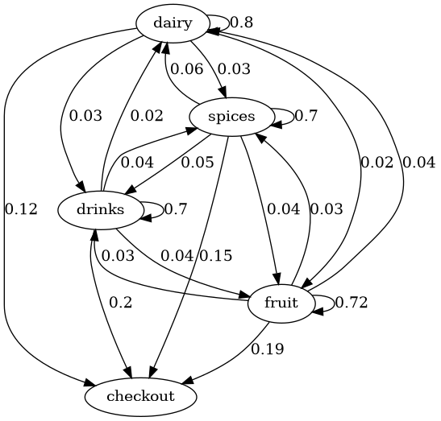

# Project: Supermarket Simulation

### Description

This project simulates customer behaviour in a supermarket.

### Goal

* Calculate transition probabilities
* Implement a Markov Chain-based data generator
* Write a simulator
* Visualize the customer movement

### Usage

* Install packages from requirements.txt
* Run supermarket.py for simulation
* Run eda_supermarket for exploratory data analysis

